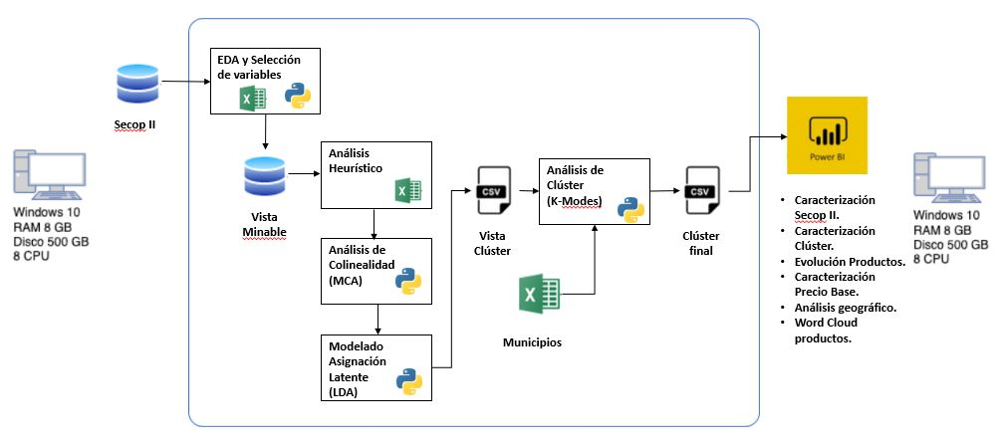

# Proyecto de Segmentación: Alianza Caoba
Este documento presenta la decripción de la solución, la arquitectura y las principales consideraciones y pasos requeridos para realizar el despliegue e instalación para la segmentación en Alianza Caoba.

[Carpeta de Drive asociada al proyecto:](https://teams.microsoft.com/_?tenantId=99f7b55e-9cbe-467b-8143-919782918afb#/conversations/19:17f5cb89752f48aba3af36c16c909ecb@thread.v2?ctx=chat)

[Informe Final Proyecto](https://gitlab.com/-/ide/project/CAOBA-Central/pruebas-concepto/eafit/proy-segmentacion/tree/master/-/docs/Informe%20Final%20Proyecto%20Integrador%20EAFIT%20-%20Caoba.pdf/)

[Presentacion al negocio](https://gitlab.com/CAOBA-Central/pruebas-concepto/eafit/proy-segmentacion/-/blob/master/docs/Proy%20Integrador%20EAFIT%20-%20Caoba.pdf)

## Tabla de Contenidos
* [Hipervínculo Jupyter Gitlab](#Hipervínculo-Jupyter-Gitlab)
* [Descripción de la solución](#descripción-de-la-solución)
* [Proceso de ejecucion y despliegue](#Proceso de ejecucion y despliegue)
* [Requerimientos](#requerimientos)
* [Instalacion](#instalación)
* [Autores](#autores)

## Hipervínculo Jupyter Gitlab
[EAFIT-CAOBA](https://gitlab.com/CAOBA-Central/pruebas-concepto/eafit/proy-segmentacion/-/tree/master/jupyter)

## Descripción de la solución
**Objetivo general**

Identificar y priorizar organizaciones del sector público y privado que puedan necesitar soluciones de analítica. Calcular una probabilidad de éxito en las gestiones comerciales basados en la priorización realizada anteriormente.

**Objetivos específicos**

-Agrupar empresas de sector privado según sus características e identificar cuáles de esos grupos son ideales para ofrecerles proyectos de analítica (Servicios de Alianza CAOBA).

-Identificar cuáles empresas del sector público van a realizar inversiones en proyectos de analítica en los próximos años.

### Entregables

**[Producto 1:](https://gitlab.com/CAOBA-Central/pruebas-concepto/eafit/proy-segmentacion/-/blob/master/docs/Informe%20Final%20Proyecto%20Integrador%20EAFIT%20-%20Caoba.pdf)** Reporte técnico con los diagnósticos relacionados para considerar en el proyecto, específicamente los que se relacionan con ciencia de datos.

**Producto 2:**  Código ejecutable que permite ejecutar los notebooks de los modelos presentados en el proyecto.

**[Producto 3:](https://gitlab.com/CAOBA-Central/pruebas-concepto/eafit/proy-segmentacion/-/blob/master/dashboard/Secop%20II%20-%20Reporte%20Segmentaci%C3%B3n%2020210707.pbix)** Dashboard en PowerBI, acorde a los requisitos de visualización del DNP que integre y comunique satisfactoriamente :

-Vista con evolución por año en número de entidades, número de contratos, ubicación.

-Reconocimiento del tipo de proceso de contratación, los montos, por entidad, por meses, años y ubicación.

-Identificación de productos y porcentaje.

-Evolución de la caracterización a partir de los clusters


### Preguntas de Investigación Esenciales:
Como estrategia de Alianza CAOBA se quiere entender del universo de empresas (Privadas y Públicas) cuáles son las que tienen mayor inclinación analítica para ser contactadas y así enfocar mejor los esfuerzos de la estrategia comercial.

El líder de innovación quiere resolver la siguiente pregunta: ¿cuáles son las empresas que se deben contactar dadas las variables asociadas con innovación en analítica internamente en las entidades (Privadas y Públicas)?

### Impacto potencial esperado en el Negocio
Se quiere al final de este ejercicio tener una solución capaz de Recibir las fuentes organizadas, Generar una vista minable y finalmente llegar a un modelo que dé como resultado una métrica (entre 0 y 1) que permite determinar un top de empresas sobre las cuales se debe implementar la estrategia comercial.


## Arquitectura de la solución



## Estructura del proyecto
```
.
├── ./README.md
├── ./root.py
├── ./Dockerfile
├── ./sonar-project.properties
├── ./conf
├── ./src
│   ├── ./src/CRojas04
│   │   └── ./src/CRojas04/lda.py
│   ├── ./src/DavidRJ
│   │   ├── ./src/DavidRJ/Analisis_Heuristico.py
│   │   ├── ./src/DavidRJ/EDA-Fuente-2-Dates.py
│   │   ├── ./src/DavidRJ/EDA-Fuente-2-Vista-Minable.py
│   │   ├── ./src/DavidRJ/Fuente_2_Clusters.py
│   │   ├── ./src/DavidRJ/Fuente_2_Experimento_02.py
│   │   └── ./src/DavidRJ/log
│   └── ./src/cmartinez
│       ├── ./src/cmartinez/fuente1_mining_view.py
│       └── ./src/cmartinez/utils.py
├── ./jupyter
│   ├── ./jupyter/CRojas04
│   │   ├── ./jupyter/CRojas04/EDA-Fuente-2CristianR.ipynb
│   │   ├── ./jupyter/CRojas04/LDA+HDPvistaminable3.6\ (1).ipynb
│   │   ├── ./jupyter/CRojas04/LDA+HDPvistaminablefinalv\ (1).ipynb
│   │   ├── ./jupyter/CRojas04/LDA+HDPvistaminablefinalversion.ipynb
│   │   ├── ./jupyter/CRojas04/LDA_version_1.ipynb
│   │   ├── ./jupyter/CRojas04/LDAvistaminable1.ipynb
│   │   ├── ./jupyter/CRojas04/LDAvistaminable2.0.ipynb
│   │   ├── ./jupyter/CRojas04/LDAvistaminable3.0.ipynb
│   │   ├── ./jupyter/CRojas04/MCA_Prince\ (1).ipynb
│   │   └── ./jupyter/CRojas04/textprepNLTK.ipynb
│   ├── ./jupyter/DavidRuaJ
│   │   ├── ./jupyter/DavidRuaJ/EDA-Fuente-2-Dates.ipynb
│   │   ├── ./jupyter/DavidRuaJ/EDA-Fuente-2-Vista-Minable.ipynb
│   │   ├── ./jupyter/DavidRuaJ/EDA-Fuente-2.ipynb
│   │   ├── ./jupyter/DavidRuaJ/Fuente_2_Clusters.ipynb
│   │   ├── ./jupyter/DavidRuaJ/Fuente_2_Experimento_01.ipynb
│   │   └── ./jupyter/DavidRuaJ/Fuente_2_Experimento_02.ipynb
│   ├── ./jupyter/cmartinez
│   │   ├── ./jupyter/cmartinez/00Pandas_profiling_Exploratory_Analysis_Segmentacion.ipynb
│   │   ├── ./jupyter/cmartinez/01EDA_Revision1.ipynb
│   │   ├── ./jupyter/cmartinez/02EDA_Revision2.ipynb
│   │   ├── ./jupyter/cmartinez/03Comparison_with_Leila_DNP.ipynb
│   │   ├── ./jupyter/cmartinez/04Comparison_with_Leila_DNP.ipynb
│   │   ├── ./jupyter/cmartinez/05Integrating_datasets.ipynb
│   │   └── ./jupyter/cmartinez/html_reports
│   ├── ./jupyter/code_resources_caoba
│   │   └── ./jupyter/code_resources_caoba/cross-reference-divipola
│   ├── ./jupyter/dpatinob
│   │   ├── ./jupyter/dpatinob/Analisis_de_dependencias.ipynb
│   │   ├── ./jupyter/dpatinob/Analisis_de_dependencias.py
│   │   ├── ./jupyter/dpatinob/Fuente_2_conjunta.ipynb
│   │   └── ./jupyter/dpatinob/dpatinob.rar
│   ├── ./jupyter/dvasqu18
│   │   ├── ./jupyter/dvasqu18/Analisis_MCA_final.ipynb
│   │   ├── ./jupyter/dvasqu18/Analisis_Univariado.ipynb
│   │   ├── ./jupyter/dvasqu18/EDA-Fuente2(Asignaciones).ipynb
│   │   ├── ./jupyter/dvasqu18/Guia_Encoding.ipynb
│   │   ├── ./jupyter/dvasqu18/KNN_Grower.ipynb
│   │   ├── ./jupyter/dvasqu18/MCA_Prince.ipynb
│   │   └── ./jupyter/dvasqu18/MCA_example.ipynb
│   └── ./jupyter/ybarcelo
│       └── ./jupyter/ybarcelo/ybarcelo_Fuente2..ipynb
├── ./data
│   ├── ./data/01-Trascient
│   │   ├── ./data/01-Trascient/1000_Empresas_mas_grandes_del_pa_s.csv
│   │   ├── ./data/01-Trascient/Base-Completa-Estados-Financieros-2020.xlsx
│   │   ├── ./data/01-Trascient/Divipola.xlsx
│   │   └── ./data/01-Trascient/Fuente1_years_17_18.pickle
│   ├── ./data/02-Raw
│   │   ├── ./data/02-Raw/Fuente1_initial.pickle
│   │   ├── ./data/02-Raw/Fuente1_vista_minable.pickle
│   │   ├── ./data/02-Raw/Fuente_2_vista_minable.pickle
│   │   ├── ./data/02-Raw/Fuente_3.csv
│   │   ├── ./data/02-Raw/Pivot_Fuente_2_vista_minable.xlsx
│   │   ├── ./data/02-Raw/analisis_heuristico.csv
│   │   ├── ./data/02-Raw/analisis_heuristico.pickle
│   │   ├── ./data/02-Raw/analisis_uni_multi.pickle
│   │   ├── ./data/02-Raw/asesoria.csv
│   │   ├── ./data/02-Raw/asesoria.pickle
│   │   ├── ./data/02-Raw/df_raw_fuente_2.pickle
│   │   ├── ./data/02-Raw/indice_nit.csv
│   │   ├── ./data/02-Raw/mca.csv
│   │   └── ./data/02-Raw/mca_coordinates.svg
│   ├── ./data/03-Trusted
│   │   ├── ./data/03-Trusted/ETL_Municipios.csv
│   │   ├── ./data/03-Trusted/analisis_heuristico.csv
│   │   ├── ./data/03-Trusted/analisis_heuristico.pickle
│   │   ├── ./data/03-Trusted/analisis_uni_multi.pickle
│   │   ├── ./data/03-Trusted/asesoria.pickle
│   │   ├── ./data/03-Trusted/dataminusc_ybarcelo.xls
│   │   ├── ./data/03-Trusted/dptos.xlsx
│   │   ├── ./data/03-Trusted/fuente2_minnig_view.pickle
│   │   ├── ./data/03-Trusted/hdp_visualizationestrategica.html
│   │   ├── ./data/03-Trusted/hdp_visualizationmisiovision.html
│   │   ├── ./data/03-Trusted/hdp_visualizationproducto.html
│   │   ├── ./data/03-Trusted/lda_visualizanombre_productofinal.html
│   │   ├── ./data/03-Trusted/lda_visualizationestrategica.html
│   │   ├── ./data/03-Trusted/lda_visualizationestrategica2.0.html
│   │   ├── ./data/03-Trusted/lda_visualizationmisiovision.html
│   │   ├── ./data/03-Trusted/lda_visualizationmisiovision2.0.html
│   │   └── ./data/03-Trusted/lda_visualizatioproducto.html
│   ├── ./data/04-Refined
│   │   ├── ./data/04-Refined/Cluster_final.csv
│   │   ├── ./data/04-Refined/Cluster_final.pickle
│   │   ├── ./data/04-Refined/Cluster_final.xlsx
│   │   └── ./data/04-Refined/LDA+HDPvistaminablefinalv\ (1).ipynb
├── ./dashboard
│   ├── ./dashboard/Proyecto\ CAOBA.pbix
│   ├── ./dashboard/Secop\ II\ -\ Reporte\ Segmentacio?\201n\ 20210624.pbix
│   ├── ./dashboard/Secop\ II\ -\ Reporte\ Segmentacio?\201n\ 20210627.pbix
│   ├── ./dashboard/Secop\ II\ -\ Reporte\ Segmentacio?\201n\ 20210628.pbix
│   ├── ./dashboard/Secop\ II\ -\ Reporte\ Segmentacio?\201n\ 20210629.pbix
│   ├── ./dashboard/Secop\ II\ -\ Reporte\ Segmentacio?\201n\ 20210707.pbix
│   ├── ./dashboard/Secop\ II\ -\ Reporte\ Segmentacio?\201n.pbix
│   └── ./dashboard/lda_visualizanombre_productofinal.html
├── ./deploy
├── ./docs
│   ├── ./docs/07-Datalakes_AWS-20211.pdf
│   ├── ./docs/20-05-21\ PPT\ Negocio.pptx
│   ├── ./docs/21-04-21\ PPT\ Negocio\ (con\ comentarios).pptx
│   ├── ./docs/31-05-21\ PPT\ Negocio.pptx
│   ├── ./docs/Guia_Encoding.html
│   ├── ./docs/Informe\ Final\ Proyecto\ Integrador\ EAFIT\ -\ Caoba.docx
│   ├── ./docs/Informe\ Final\ Proyecto\ Integrador\ EAFIT\ -\ Caoba.pdf
│   ├── ./docs/Proy\ Integrador\ EAFIT\ -\ Caoba.pdf
│   ├── ./docs/Proy\ Integrador\ EAFIT\ -\ Caoba.pptx
│   ├── ./docs/Visualization\ Awareness\ 20210624.pptx
│   ├── ./docs/Visualization\ Awareness.pptx
├── ./img
│   ├── ./img/Diagrama_Flujo_Fuente_2_v1.png
│   ├── ./img/Diagrama_Flujo_Fuente_2_v2.png
│   ├── ./img/Diagrama_Flujo_Fuente_3_v1.png
│   ├── ./img/MCA.png
│   ├── ./img/Modelo_Datos_Secop_II_v0.JPG
│   ├── ./img/Modelo_Datos_Secop_II_v1.JPG
│   ├── ./img/clusters.png
│   ├── ./img/kmodes.png
│   ├── ./img/mca_coordinates.svg
│   ├── ./img/productos.png
│   ├── ./img/screenshot.png
│   └── ./img/visnombrepreductoajuste.png
└── ./temp
    ├── ./temp/README.md
    ├── ./temp/docs
    ├── ./temp/src
        └── ./temp/src/logic
```

### Solución Alianza CAOBA
De acuerdo al Dashborad BI, se encontró 145 posibles entidades que podrías estar interesadaas en contratar los servicios de Aliaza CAOBA, de las cuales 67 productos nos indican que podrían estar asociados con los servicios de alianza CAOBA.

## Proceso de ejecucion y despliegue

### Parte 1: Generacion de Vista Minable y Modelos

Partiendo del objetivo principal del análisis realizado, en el cual se debe entregar un listado de empresas que estén dispuestas a adquirir proyectos de analítica, y seguido al análisis exploratorio de datos, se pudo evidenciar que la información requiere de modelos no supervisados.

De acuerdo con las variables seleccionadas se pretende encontrar patrones que nos permitan hacer agrupaciones de aquellas empresas que de acuerdo con la información de la fuente se puedan segmentar en las que estarán dispuestas a adquirir proyectos de tecnología.

Por tanto la ejecución del Proyecto consiste en dos pasos:

- Paso 0: Obtener vista minable

```
ipython src/DavidRJ/EDA-Fuente-2-Vista-Minable.py
```


- Paso 1: Ejecucion de modelos

**[1. Modelo Heurístico](hhttps://gitlab.com/CAOBA-Central/pruebas-concepto/eafit/proy-segmentacion/-/blob/master/data/02-Raw/Pivot_Fuente_2_vista_minable.xlsx)**

Paso 1.1: Se realiza un filtrado en Excel que permite una reducción en el dataset a trabajar. Dicho filtro se realiza usando [Tablas dinámicas](https://gitlab.com/CAOBA-Central/pruebas-concepto/eafit/proy-segmentacion/-/blob/master/data/02-Raw/Pivot_Fuente_2_vista_minable.xlsx) en excel.

Paso 1.2: Con la reducción de la dimensionalidad de las variables se identifican los productos a trabajar que se filtrarán en el MCA.

Paso 1.3: Se ejecuta el filtro usando el siguiente comando:
```
ipython src/dvasqu18/Analisis_Heuristico_final.py
```

**[2. Modelo MCA (Análisis de Correspondencia Múltiple):](https://gitlab.com/CAOBA-Central/pruebas-concepto/eafit/proy-segmentacion/-/blob/master/jupyter/dvasqu18/Analisis_MCA_final.ipynb)** detecta y representa estructuras en el conjunto de datos y dependencia entre las variables de las mismas.

Paso 2.1: Se ejecuta el modelo usando el siguiente comando:
```
ipython src/dvasqu18/Analisis_MCA_final.py
```

**[3. Modelo LDA (Latent Dirichlet Allocation):](https://gitlab.com/CAOBA-Central/pruebas-concepto/eafit/proy-segmentacion/-/blob/master/jupyter/CRojas04/LDA+HDPvistaminablefinalversion.ipynb)** asigna tópicos al corpus y genera distrubuciones de temas sobre las palabras relevantes para el negocio.

Paso 3.1: Se ejecuta el modelo usando el siguiente comando:

```
ipython src/CRojas04/LDAfinalversion.py
```

**[4. Modelo de Clusters (K-Modes):](https://gitlab.com/CAOBA-Central/pruebas-concepto/eafit/proy-segmentacion/-/blob/master/jupyter/DavidRuaJ/Fuente_2_Clusters.ipynb)** agrupa las empresas por las palabras claves en temas de analítica, y luego agruparlas por ciudad, y luego analizar los montos presupuestales que tienen asignado, esto le dará a la empresa una visión más clara de los clientes a los que desea llegar.

Paso 4.1: Se ejecuta el modelo usando el siguiente comando:

```
ipython src/DavidRJ/Fuente_2_Clusters.py
```

- Paso 4.2: Luego de aplicar los modelos anteriormente señalados, buscar los distintos filtros que se necesite en el dashboard, por medio de la herramienta Power BI.

### Parte 2: Visualización


El Dashboard presentado nos permite dar solución a la pregunta esencial planteada desde el inicio del proyecto permitiendo satisfacer los siguientes requerimientos sugeridos por parte del negocio.

1.	Vista con evolución por año en número de entidades, número de contratos, ubicación.
2.	Reconocimiento del tipo de proceso de contratación, los montos, por entidad, por meses, años y ubicación.
3.	Identificación de productos y porcentaje.
4.	Evolución de la caracterización a partir de los clusters.


### Librerias Empleadas

pandas\
numpy\
seaborn\
matplotlib\
datetime\
pickle\
sklearn\
scipy\
smart-open\
Gensim\
nltk\
pyLDAvis\
prince

## Requerimientos

### Requerimientos Software

A continuación, se presentan los requerimientos correspondientes de software para el despliegue de la aplicación desarrollada.

| Requerimiento   |           |
|----------|-------------|
| Python |  >=3.4 |
| Sistema Operativo |  Ubuntu |
| Contenedor de software | Docker 18.06.3|
| Consolas virtuales | Screen 4.00|
| Sistemas de control de versiones | Git 1.8.3|
|Power BI | Versión 2.94.921.0 64-bit  (Junio de 2021)|

### Requerimientos Hardware

A continuación, se presentan los requerimientos correspondientes de hardware para el despliegue de la aplicación desarrollada.Para un óptimo procesamiento de datos y para una buena ejecución del análisis de modelos de clúster se recomienda un equipo con las siguientes características:

| Requerimiento   |           |
|----------|-------------|
| Memoria RAM |  16 GB |
| Almacenamiento |    500 GB   |
| CPU | Cantidad de núcleos 16, cantidad de subprocesos 32, frecuencia básica del procesador 2.30 GHz|


## Instalación:
Instalar anaconda para utilizar Jupyter notebook y poder acceder a los archivos ipynb u otra alternativa es utilizarlos en google colab (tener cuenta gmail)

https://docs.anaconda.com/anaconda/install/

## Proceso de instalación de ambiente del proyecto

`conda create -n proy-segmentacion python=3.8`

`conda activate proy-segmentacion`

`conda install --file requirements.txt`

## Autores

| Organización   | Nombre del Miembro | Correo electronico |
|----------|-------------|-------------|
| Alianza Caoba |  Camila Martinez: Lider tecnica, Cientific@ de Datos | cientificodatos1@alianzacaoba.co |
| Alianza Caoba  |  Juan Sebastián Sandino Ariza: Líder de innovación   | jsandino@javeriana.edu.co |
| Universidad Eafit  |  Cristian David Rojas Rincón: Cientific@ de Datos  |  cdrojasr@eafit.edu.co |
| Universidad Eafit  |  Daniela Vasquez Jaramillo: Cientific@ de Datos  |  dvasqu18@eafit.edu.co |
| Universidad Eafit  |  Daniel Patiño Barraza: Cientific@ de Datos  |  dpatinob@eafit.edu.co |
| Universidad Eafit  |  David Rua Jaramillo: Cientific@ de Datos  |  druaj@eafit.edu.co |
| Universidad Eafit  |  Yaliza Margarita Barcelo Pulgar: Cientific@ de Datos  |  ymbarcelop@eafit.edu.co |
